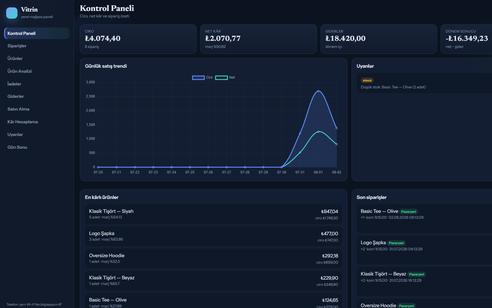
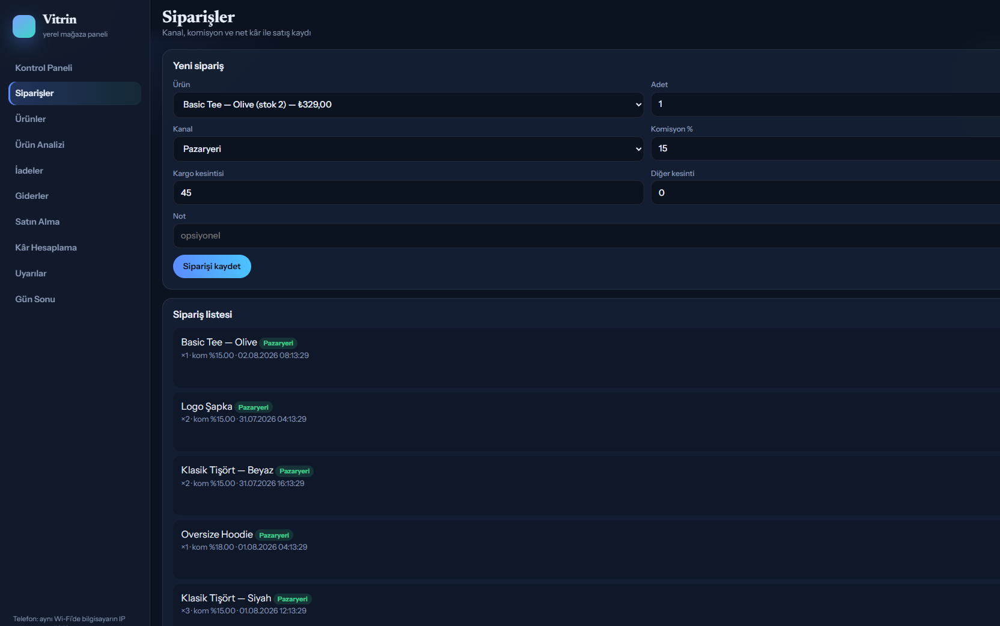
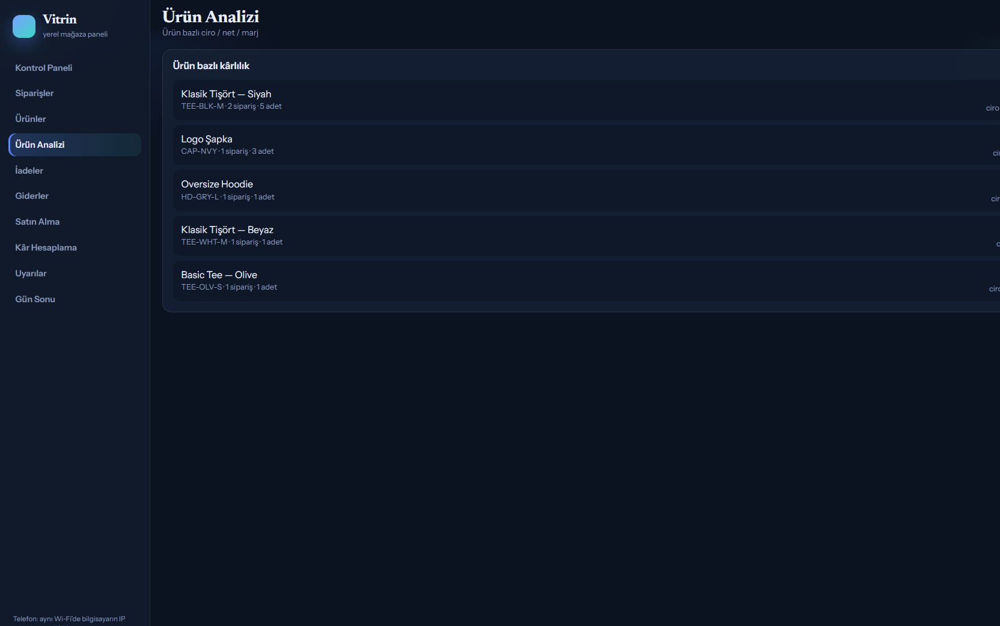

# Vitrin (ShopTrack)

Local panel for a small shop: sales, net profit, marketplace fees, stock, expenses.

Runs on your PC (`start.bat`), browser UI, phone works on the same Wi-Fi. Data is a SQLite file — nothing in the cloud.

## Screenshots







## Net

```
net = gross - cost - commission - shipping - other
```

Orders have a channel (`Magaza` / `Pazaryeri` / `Diger`) so marketplace commission sits on the line. Returns put stock back. Purchases update average cost. Day close locks the day.

UI is Turkish. Code comments / this file are English.

## Run

Double-click `start.bat`, then open http://127.0.0.1:7070

```bash
python -m venv .venv
.venv\Scripts\activate
pip install -r requirements.txt
uvicorn app.main:app --host 0.0.0.0 --port 7070
```

## API

Useful routes if you wire a marketplace sync later:

- `GET /api/dashboard`
- `GET|POST /api/sales`
- `POST /api/sales/{id}/return`
- `GET /api/analysis/products`
- `GET|POST /api/expenses`, `/api/purchases`, `/api/day-closes`
- `POST /api/tools/price-sim`

FastAPI + SQLite + Chart.js
